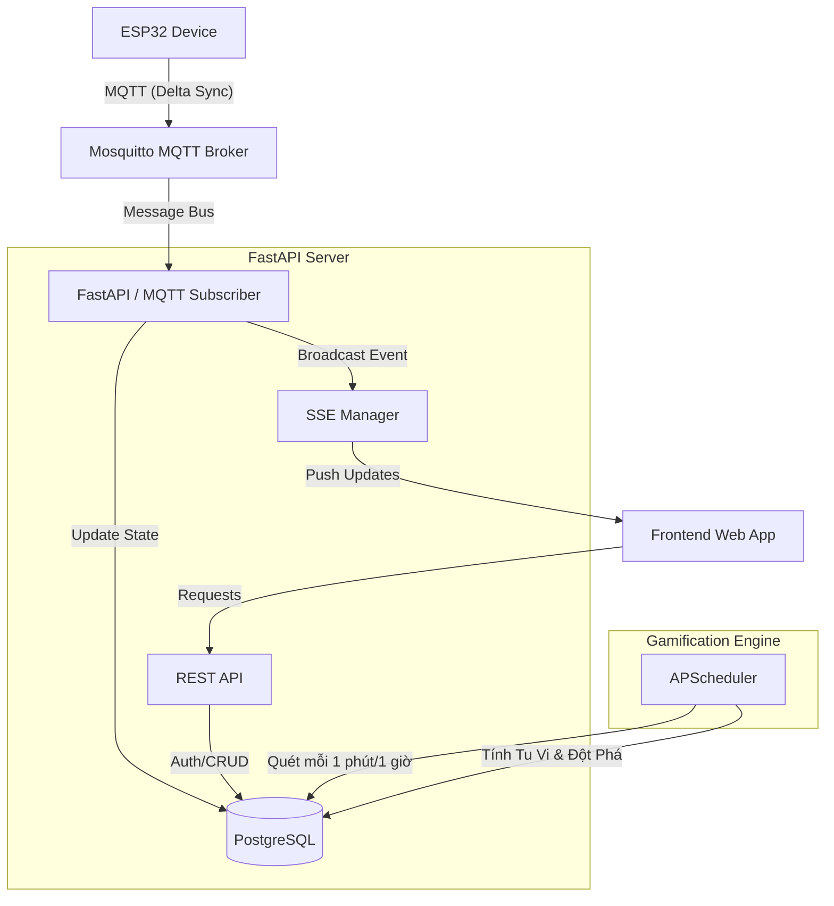

# Kiến Trúc Hệ Thống (System Architecture)
# Dự án: Mộc Đạo Tu Tiên (Flora Cultivation)

> **Bản cập nhật:** Phiên bản v2.0 (Hỗ trợ Delta Sync & Đa chậu)

Tài liệu này trình bày tổng quan về kiến trúc, cơ chế hoạt động, lược đồ cơ sở dữ liệu và các giao thức truyền thông của dự án **Mộc Đạo Tu Tiên**.

---

## 1. Tổng quan Kiến trúc (Overview)
Hệ thống sử dụng mô hình kết hợp giữa **Event-Driven (Real-time Telemetry)** và **Batch Processing (Gamification)** nhằm giải quyết bài toán chịu tải IoT lớn và tối ưu hóa thời lượng Pin cho thiết bị phần cứng.



---

## 2. Các Cơ chế Vận hành Cốt lõi (Core Mechanisms)

### 2.1. Telemetry & Delta Sync (IoT)
Thiết bị IoT (ESP32) đo đạc liên tục cục bộ và gửi dữ liệu thông qua cơ chế **Delta Sync**:
- Thiết bị duy trì kết nối WiFi liên tục.
- Thiết bị chỉ publish bản tin MQTT lên Server khi phát hiện có biến thiên chỉ số vượt ngưỡng: **Nhiệt độ thay đổi >= 0.5C**, hoặc **Độ ẩm không khí thay đổi >= 3%**, hoặc thay đổi trạng thái lỗi DHT.
- Mạch gửi bản tin giữ nhịp (Heartbeat) định kỳ **mỗi 5 phút** để báo trạng thái hoạt động (online).
- Bổ sung: Cảm biến ánh sáng BH1750 bị loại bỏ hoàn toàn khỏi thuật toán đánh giá chất lượng và logic lỗi để tránh lỗi phần cứng làm gián đoạn tu luyện (chỉ gửi dữ liệu thô).
- Backend tiếp nhận dữ liệu, cập nhật trạng thái `current_overall_quality` và bắn sự kiện qua **SSE (Server-Sent Events)** về Client để người dùng thấy Dashboard nhảy số ngay lập tức.

### 2.2. Cơ chế Tu Vi & Chống Gian Lận (Gamification Engine)
Để tối ưu hóa gameplay và ngăn chặn gian lận:
- **Tích lũy Tu Vi cục bộ (mỗi 6s)**: Thiết bị tự động cộng/trừ Tu Vi mịn mỗi 6 giây dựa trên chất lượng môi trường đo được tức thời (Excellent/Optimal: +1.0, Good: +0.5, Fair: +0.0, Poor: -0.3, Danger: -0.8). Đóng băng (cộng 0 EXP) khi offline hoặc lỗi cảm biến.
- **Đồng bộ hóa định kỳ (mỗi 1 phút)**: Bộ lập lịch APScheduler trên Backend chạy ngầm quét bảng `plants` mỗi 1 phút để cập nhật/đồng bộ EXP dựa vào trạng thái môi trường tổng hợp của cây trồng.
- **Chống Spam (Anti-Spam)**: Sử dụng Rolling Window Rate Limit trong bộ nhớ RAM (`defaultdict(list)`). Chỉ đánh dấu là spam và bỏ qua tính điểm nếu thiết bị gửi dữ liệu liên tiếp >= 5 lần trong 5 giây gần nhất, giúp linh hoạt nhận dữ liệu biến đổi nhanh mà vẫn chống được hack điểm.
- **Đóng băng do Mất mạng (Offline Penalty)**: Nếu thiết bị mất kết nối quá **6 phút (360 giây)**, Backend tự động kích hoạt hình phạt ngoại tuyến, đóng băng EXP tích lũy (`OFFLINE_PENALTY`).

### 2.3. Hỗ trợ Đa Chậu (Multi-plant) & DIY Provisioning
- Một người dùng (User) có thể liên kết (Pair) với **nhiều chậu cây** cùng lúc (quan hệ `1-N`).
- Người dùng có thể tự gọi API `/api/plants/diy-provision` để tự cấp mã `Plant Code` và `Verify Code`, hỗ trợ mô hình tự làm thiết bị phần cứng (DIY/Developer).

---

## 3. Kiến trúc Dữ liệu (Database Schema)

Hệ thống sử dụng **PostgreSQL** thông qua SQLAlchemy.

- **Users:** Thông tin người dùng (Google OAuth).
- **Devices:** Định danh phần cứng IoT (`plant_code`, `verify_hash`).
- **Plants:** Trung tâm hệ thống (Liên kết `User` <-> `Device`). Lưu trữ Tu Vi, cấp bậc (`current_rank_id`), và trạng thái môi trường mới nhất (`current_overall_quality`).
- **SensorReadings:** Dữ liệu lịch sử cảm biến thời gian thực (Time-series).
- **ExpLogs & BreakthroughEvents:** Nhật ký cộng điểm và lịch sử thăng cấp.
- **Config (ExpConfig, RankConfig, PlantTypes):** Các cấu hình game balance và ngưỡng sinh thái tiêu chuẩn.

---

## 4. Giao tiếp Truyền thông (Protocols)

| Luồng giao tiếp | Giao thức | Mục đích |
|---|---|---|
| **Device -> Backend** | **MQTT** | Gửi dữ liệu cảm biến nhẹ, nhanh, tối ưu băng thông. Thiết bị sử dụng `client_id` duy nhất để chống giả mạo. |
| **Backend -> Frontend** | **SSE (Server-Sent Events)** | Truyền tải dữ liệu một chiều (Live Dashboard) giúp Frontend tự cập nhật thông số ngay khi môi trường thay đổi. |
| **Frontend -> Backend** | **REST (HTTPS)** | Các tác vụ quản lý: Đăng nhập Google, tự cấp mã (DIY), liên kết cây, xem bảng xếp hạng. Bảo mật bằng JWT. |

---

## 5. Danh sách API Chính (Core APIs)

### 5.1. Authentication (Xác thực)
- `POST /api/auth/google`: Đăng nhập bằng Google ID Token, nhận JWT (Access & Refresh).
- `GET /api/auth/me`: Thông tin người dùng hiện tại (kèm danh sách cây sở hữu).
- `POST /api/devices/{plant_code}/auth`: (IoT AUTH) Mạch ESP32 gọi khi khởi động, xác thực bằng `verify_code` để nhận về JWT `token`, `thresholds` (ngưỡng lý tưởng của giống cây), `next_reward_in_seconds` cùng giá trị `total_exp` và `rank_name` hiện thời trong DB để đồng bộ màn hình OLED ngay lập tức.

### 5.2. Quản lý Chậu cây (Plants)
- `POST /api/plants/diy-provision`: Tự tạo mã nạp thiết bị cho User DIY.
- `POST /api/plants/pair`: Liên kết Device vào tài khoản User.
- `GET /api/plants/me/dashboard`: Lấy thông tin cây để hiển thị màn chính.
- `GET /api/plants/me/history`: Xem biểu đồ dữ liệu lịch sử môi trường.

### 5.3. IoT Ingestion (Telemetry)
- **Thiết bị gửi Telemetry (Publish)**: Topic `devices/{plant_code}/telemetry`
  - Payload dạng JSON:
    ```json
    {
      "token": "jwt_token_sau_khi_auth",
      "sensors": [
        { "key": "soil_moisture", "value": 45.0 },
        { "key": "light", "value": 1000.0 },
        { "key": "temperature", "value": 28.0 },
        { "key": "humidity", "value": 60.0 }
      ]
    }
    ```
- **Backend phản hồi trạng thái (Subscribe)**: Topic `devices/{plant_code}/response`
  - Server gửi thông số Tu Vi cập nhật ngay lập tức sau khi nhận Telemetry:
    ```json
    {
      "total_exp": 123.5,
      "rank_name": "Luyen Khi",
      "status": "ok",
      "message": "Xử lý thành công"
    }
    ```

### 5.4. Leaderboard (Xếp hạng)
- `GET /api/leaderboard`: Danh sách cao thủ Tu Tiên (Top Cây có Tu Vi cao nhất).

---

## 6. Technology Stack (Công nghệ sử dụng)
- **Framework:** FastAPI (Python 3.12, Async).
- **Database:** PostgreSQL + SQLAlchemy 2.0 + Alembic + AsyncPG.
- **Message Broker:** Eclipse Mosquitto (MQTT).
- **Job Scheduler:** APScheduler (Background Cronjob).
- **Security:** JWT Authentication (Google OAuth), Bcrypt Hashing.
